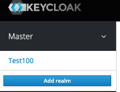

# SSO

**📌   목표 - Gitlab을 Keycloak SAML방식을 이용한 SSO 환경 구축**

- 구축 환경

    docker-desktop (mac) & kubernetes

    **local**에서 작동

        1. Keycloak pod 띄우기
        2. gitlab pod 띄우기
        3. Keycloak -gitlab SSO 환경구축
            SAML 방식이용
        4. Keycloak API 이용
---

### Keycloak 설치

local에서 작동하므로 ingress 없이 

`kubectl create -f [https://raw.githubusercontent.com/keycloak/keycloak-quickstarts/latest/kubernetes-examples/keycloak.yaml](https://raw.githubusercontent.com/keycloak/keycloak-quickstarts/latest/kubernetes-examples/keycloak.yaml)`

두가지 방법 중 선택

1. `kubectl edit svc keycloak` 해서 loadbalancer 를 NodePort로 바꿔주던가

    Keycloak 페이지 주소 : http://localhost:<nodeport>

2. kecloack **설치 이전**에 (keycloak을 먼저설치하면 pending상태로 지속됨)
nginx 컨테이너 nodeport로 expose
    저절로  loadbalancer 의 External_IP가  localhost로 설정됨
    어떻게 이렇게 작동된지는 모르겠음!! 원래 local에서는 loadbalancer실행 X
    Keycloak 페이지 주소 : http://localhost:8080

---
### Gitlab 설치

두가지 방법 중 선택 (여기서는 2번방법 이용)

1.  helm 사용

    설치 :[https://docs.gitlab.com/charts/installation/](https://docs.gitlab.com/charts/installation/)

2. image 이용해서 deployment > service : NodePort 로 설정
    - command 이용하는 방법

        `kubectl create deployment gitlab --image=gitlab/gitlab-ce:latest --port=80`

        `kubectl expose deployment gitlab --type=NodePort --port=80 --target-port=80 --name=gitlab-service`

    - yaml파일을 이용하는 방법 (command 방법은 nodeport를 지정해줄수 없다!)
        - gitlab.yaml

            ```yaml
            # gitlab.yaml
            apiVersion: apps/v1
            kind: Deployment
            metadata:
              name: gitlab
              labels:
                app: gitlab
            spec:
              replicas: 1
              selector:
                matchLabels:
                  app: gitlab
              template:
                metadata:
                  labels:
                    app: gitlab
                spec:
                  containers:
                  - name: gitlab-container
                    image: gitlab/gitlab-ce:latest
            ---
            apiVersion: v1
            kind: Service
            metadata:
            	name: gitlab-service
            spec:
            	ports:
            	- nodePort: 30010 # Random assignment from 30000 to 32767, if omitted
            	  port: 80 # Allocate the same value as targetPort if omitted
            	  targetPort: 80
            	selector:
            	  app: gitlab
            ```

        gitlab은 실행된 이후 5분정도 이후에 접속가능

        >> 바로 직후엔  ~~curl: (52) Empty reply from server이거나  502 whoops something went wrong on our end 에러뜸~~

#. gitlab설치 후 잘 안돌아가면 —> kubernetes  문제임

docker-desktop의 setting — resource > memory를 올려주어라!

---
### Keycloak - Gitlab 연동

여기서는 keycloak의  SAML 방식이용

- Keycloak setting

    [http://localhost:8080/auth](http://localhost:8080/auth로) 

    처음 접근시: [master realm = admin]계정으로 접근 (`아이디 admin/ 비번 admin` : keycloak설치시 yaml파일에서 초기 아이디,비번 지정해줌)

    1. realm 생성

        : 초기에는 Master Realm만 존재

         but, 우리는 Master가 아닌 MSA에서 사용할 Realm이 필요하기때문에 생성

        

        "Add realm"로 생성

        Realm Settings 에서 
        { 일반설정, 로그인 화면 설정, 키 암호화 설정, 이메일 서비스 설정, 로그인/회원가입 등의 테마 설정, 캐시 설정, 토큰 설정} 등 —— > 필요시 공식문서 참고할것!

    2. user 생성

        realms 안에서 관리자를 통해 유저를 생성할 수 있다.

        <사용하고자하는 realm>환경임을 확인 -> Manage -> Users 클릭 -> Add User 클릭한다

        

        이후 생성되면 "credentials"탭에서 유저에게 임시비밀번호 발급해준다 (Set Password)해줌

    3. client 생성
        - gitlab 과 SAML 로 SSO 를 할꺼니깐 설정해줘야함
        - client 생성 시 "SAML"  Protocol로 생성 >> 이후 아래와 같이 설정

        

        

        

        IDP initiated SSO URL Name = client명과 같게 해주기

        - 해당 client의 Mapper 설정해주기

            Create protocol Mapper 

            - 이름: `email`
                - 매퍼 유형 : `User Property`
                - 특성: `Email`
                - 친근감있는 이름: `Email`
                - SAML 속성 이름 : `email`
                - SAML 속성 이름 형식 : `Basic`
            - 이름: `name`
                - 매퍼 유형 : `User Property`
                - 특성: `Username`
                - 친근감있는 이름: `Username`
                - SAML 속성 이름 : `name`
                - SAML 속성 이름 형식 : `Basic`
            - 이름: `first_name`
                - 매퍼 유형 : `User Property`
                - 특성: `FirstName`
                - 친근감있는 이름: `First Name`
                - SAML 속성 이름 : `first_name`
                - SAML 속성 이름 형식 : `Basic`
            - 이름: `last_name`
                - 매퍼 유형 : `User Property`
                - 특성: `LastName`
                - 친근감있는 이름: `Last Name`
                - SAML 속성 이름 : `last_name`
                - SAML 속성 이름 형식 : `Basic`
            - 이름: `roles`
                - 매퍼 유형 : `Role list`
                - 역할 속성 이름 : `roles`
                - 친근감있는 이름: `Roles`
                - SAML 속성 이름 형식 : `Basic`
                - 단일 역할 속성 : `On`
- Gitlab setting

    Pod로 접속하여 KeyCloak의 설정값을 바꿔줌

    - 공식페이지 [https://docs.gitlab.com/ee/integration/omniauth.html](https://docs.gitlab.com/ee/integration/omniauth.html)
                      [https://docs.gitlab.com/ee/integration/saml.html](https://docs.gitlab.com/ee/integration/saml.html)
    - gitlab의 설정파일을 열어서 편집

        `sudo vim /etc/gitlab/gitlab.rb`

        OmniAuth 공급자 설정

        공식페이지 [https://docs.gitlab.com/ee/administration/auth/oidc.html](https://docs.gitlab.com/ee/administration/auth/oidc.html)

        - 인증서 정보

            Realm Settings > Keys> Public Keys의  Certificate정보 (클릭하여 값 복사하기)

            

        - OmniAuth 공급자 중 "SAML" 사용

             [https://www.debyum.com/configure-gitlab-with-keycloak/](https://www.debyum.com/configure-gitlab-with-keycloak/)

            [https://edenmal.moe/post/2018/GitLab-Keycloak-SAML-2-0-OmniAuth-Provider/?__cf_chl_captcha_tk__=abd99e96a0b76ba86f74686fd3ca96783d87b8d8-1618449110-0-Ac7yEOdq9cMmxXtZ05mffkm-WEt8xo_NfputD_f27Rqzh4jehkrLXH_jkbLwf7bbJrjdOEY8aJpa2IGwBfeWITecHQiJBG2N1taIvwrSsk9uvPv4EZP76YucqgQyQq-6mXR5x8hp2UG-ODDV-lT26fwpCBFqk3robXjakxTOShSjjSJOLXczyuc5KjOIJfQrCtrc4tsYquXSoUts953hqNyBPC1qObV5emUjzKYG8KULaYfpkYdji8vtX1cZNCPDpd7eKKjJRey6V4Ce8icUqaDf3bVIdMGmbHMBGTcuwRBFJZW5VI-feIe7m7UvbFmQZ0uV2yVqw9CDLOJAtlxwgVS8ZDht1hHM2Znt7dP8sDCOJ7BxkDYVccsjTK5bsg61w5qFZ8eBr3Xrfpw1KpfMtMXeAgp_VUSKeORiC4d2wwb9d0MXsXIqt1-cYb3xUUgocThJkLnPp3FaHktPV_Z-OMUye9UQmWI3_h-fAHzIbKR5lOCg0W6bHYhxfKv0dfCkwc0Lq46jSTAYbB2yxW5mXufairq7ABdKz29Cg1hH_giXL5n6dUGrBgTUgD7l6NqLFkWc9MBjOCoTfmZwt1VgExMDZEiYPsbObcCXgCJpMi-Q2A20D7byhu47SHNg5rbwlg8aIq5KD7nY_MID1qc2aCT7xKa4hON1vgf_86uG-nCW](https://edenmal.moe/post/2018/GitLab-Keycloak-SAML-2-0-OmniAuth-Provider/?__cf_chl_captcha_tk__=abd99e96a0b76ba86f74686fd3ca96783d87b8d8-1618449110-0-Ac7yEOdq9cMmxXtZ05mffkm-WEt8xo_NfputD_f27Rqzh4jehkrLXH_jkbLwf7bbJrjdOEY8aJpa2IGwBfeWITecHQiJBG2N1taIvwrSsk9uvPv4EZP76YucqgQyQq-6mXR5x8hp2UG-ODDV-lT26fwpCBFqk3robXjakxTOShSjjSJOLXczyuc5KjOIJfQrCtrc4tsYquXSoUts953hqNyBPC1qObV5emUjzKYG8KULaYfpkYdji8vtX1cZNCPDpd7eKKjJRey6V4Ce8icUqaDf3bVIdMGmbHMBGTcuwRBFJZW5VI-feIe7m7UvbFmQZ0uV2yVqw9CDLOJAtlxwgVS8ZDht1hHM2Znt7dP8sDCOJ7BxkDYVccsjTK5bsg61w5qFZ8eBr3Xrfpw1KpfMtMXeAgp_VUSKeORiC4d2wwb9d0MXsXIqt1-cYb3xUUgocThJkLnPp3FaHktPV_Z-OMUye9UQmWI3_h-fAHzIbKR5lOCg0W6bHYhxfKv0dfCkwc0Lq46jSTAYbB2yxW5mXufairq7ABdKz29Cg1hH_giXL5n6dUGrBgTUgD7l6NqLFkWc9MBjOCoTfmZwt1VgExMDZEiYPsbObcCXgCJpMi-Q2A20D7byhu47SHNg5rbwlg8aIq5KD7nY_MID1qc2aCT7xKa4hON1vgf_86uG-nCW)

            [https://gist.github.com/int128/ab5839d5f59829840a0204f0c8cd8a8b](https://gist.github.com/int128/ab5839d5f59829840a0204f0c8cd8a8b)

            ```ruby
            gitlab_rails['omniauth_enabled'] = true

            #사용자가 먼저 계정을 수동으로 만들지 않고도 SAML을 사용하여 가입
            gitlab_rails['omniauth_allow_single_sign_on'] = ['saml']
            # gitlab_rails['omniauth_auto_sign_in_with_provider'] = 'saml'
            gitlab_rails['omniauth_block_auto_created_users'] = false

            # gitlab_rails['omniauth_auto_link_ldap_user'] = false

            #이메일 주소가 일치하는 경우 SAML 사용자를 기존 GitLab 사용자와 자동으로 연결
            gitlab_rails['omniauth_auto_link_saml_user'] = true 

            gitlab_rails['omniauth_providers'] = [
                {
                  name: 'saml',
                  args: {
                           assertion_consumer_service_url: 'http://localhost:30010/users/auth/saml/callback',
                           idp_cert:  "-----BEGIN CERTIFICATE-----
            \n<...인증서정보 복사해서 붙여넣기....>\n-----END CERTIFICATE-----\n",
                           idp_sso_target_url: 'http://localhost:8080/auth/realms/dudaji-200/protocol/saml/clients/gitlab',
                           issuer: 'gitlab',
                           name_identifier_format: 'urn:oasis:names:tc:SAML:2.0:nameid-format:persistent'
                         },
                  label: 'Keycloak Login'
                }
            ]
            ```

        설정파일을 변경 후 무조건 설정변경 명령어를 해줘야함 `gitlab-ctl reconfigure`

        log 확인 `cat /var/log/gitlab/gitlab-rails/production.log`

### Keycloak 기타 설정

- **keycloak 로그인 페이지 꾸미기**

    [https://www.keycloak.org/docs/latest/server_development/#scripts](https://www.keycloak.org/docs/latest/server_development/#scripts)

    1. kubernetes 위에 있는 Pod ( Keycloak container)로 진입
    2. keycloak의 theme 폴더로 진입

        #. Keycloak의 기본페이지 `$JBOSS_HOME` ⇒ /opt/jboss/keycloak

        `cd /opt/jboss/keycloak/themes`

    3. theme폴더에서 새로운 나만의 폴더 생성

        제시된 양식따라 폴더 및 테마파일 생성

- **Keycloak API**

    Keycloak API 공식페이지 :
     [https://www.keycloak.org/docs-api/12.0/rest-api/#_userrepresentation](https://www.keycloak.org/docs-api/12.0/rest-api/#_uri_scheme)

    parameter 에 대한 부연 설명: 
    [https://www.keycloak.org/docs-api/12.0/rest-api/#_userrepresentation](https://www.keycloak.org/docs-api/12.0/rest-api/#_userrepresentation)

    Test가능한 Postman 공식페이지 : [https://documenter.getpostman.com/view/7294517/SzmfZHnd#e917ce53-69ea-49f3-9a94-4f6c0962c199](https://documenter.getpostman.com/view/7294517/SzmfZHnd#e917ce53-69ea-49f3-9a94-4f6c0962c199)

    - Realm Master에 대한 access_token 조회:

        **POST  Obtain access token for a user**

        url: `http://localhost:8080/auth/realms/master/protocol/openid-connect/token`

        **Headers**: Content-Type : application/x-www-form-urlencoded

        **Body :**  

        

        ```bash
        curl --location --request POST 'http://127.0.0.1:8180/auth/realms/master/protocol/openid-connect/token' \
        --header 'Content-Type: application/x-www-form-urlencoded' \
        --data-urlencode 'client_id=admin-cli' \
        --data-urlencode 'username=<master realm login 시 이용하는 username>' \
        --data-urlencode 'password=<master realm login 시 이용하는 password>' \
        --data-urlencode 'grant_type=password'
        ```

    - 회원가입 :

        **POST Create user** 

        url : `http://localhost:8080/auth/admin/realms/<회원가입하고싶은해당realm명>/users`

        **Authorization - Bearer Token** : <조회한 master의  AccessToken>

        **Headers**: Content-Type : application/json

        ```bash
        curl --location --request POST 'http://127.0.0.1:8180/auth/admin/realms/<회원가입하고싶은해당realm명>/users' \
        --header 'Content-Type: application/json' \
        --data-raw '{
                "createdTimestamp": 1588880747548,
                "username": "Strange",
                "enabled": true,
                "totp": false,
                "emailVerified": true,
                "firstName": "Stephen",
                "lastName": "Strange",
                "email": "drstranger@marvel.com",
                "disableableCredentialTypes": [],
                "requiredActions": [],
                "notBefore": 0,
                "access": {
                    "manageGroupMembership": true,
                    "view": true,
                    "mapRoles": true,
                    "impersonate": true,
                    "manage": true
                },
                "realmRoles": [	"mb-user" ]
            }'
        ```

    - 특정 Realm의 User 조회:

        **GET Get users** 

        url : `http://localhost:8080/auth/admin/realms/<조회하고 싶은 realm명>/users`

        **Authorization - Bearer Token** : <조회한 master의  AccessToken>

        **Headers**: Content-Type : application/json

        (선택사항 : 특정 사용자 조회할때 ) **Params** : Key에 {

        briefRepresentation / email / first / firstName / lastName / max / search / username} 로 검색가능

        ```bash
        curl --location --request GET 'http://127.0.0.1:8180/auth/admin/realms/<조회하고 싶은 realm명>/users'
        ```

    - 특정 User Logout:

        **POST Logout user**

        url: `http://localhost:8080/auth/admin/realms/dudaji-200/users/<조회한 user 결과값 중 "id"값>/logout`

        **Authorization - Bearer Token** : <조회한 master의  AccessToken>

        **Headers**: Content-Type : application/json

        ```bash
        curl --location --request POST 'http://127.0.0.1:8180/auth/admin/realms/<realm명>/users/<조회한 user 결과값 중 "id"값>/logout'
        ```

- DB (User Mapper??

    [https://www.baeldung.com/keycloak-custom-user-attributes](https://www.baeldung.com/keycloak-custom-user-attributes)

    [https://www.sravi.com/2018/08/how-to-add-custom-user-attributes-in.html](https://www.sravi.com/2018/08/how-to-add-custom-user-attributes-in.html)

    [https://stackoverflow.com/questions/32678883/keycloak-retrieve-custom-attributes-to-keycloakprincipal](https://stackoverflow.com/questions/32678883/keycloak-retrieve-custom-attributes-to-keycloakprincipal)
